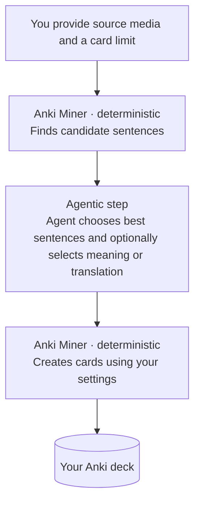

# Anki Miner Agentic

A fork of [Anki Miner](https://github.com/0xzerolight/anki_miner) that lets an agent choose useful mining candidates and add cards automatically to your deck. For the original desktop app, its features, and general help, use the [upstream README](https://github.com/0xzerolight/anki_miner#readme).


## What this fork changes

- Builds a learner profile from the Anki decks and fields you choose.
- Lets an agent rank prepared candidates, pick a dictionary meaning, and add a short translation.

## How it works



## Install

You need Python 3.11+, Anki with [AnkiConnect](https://ankiweb.net/shared/info/2055492159), and ffmpeg. Keep Anki open during setup.

```bash
git clone https://github.com/namidanokisetsu/anki_miner_agentic.git
cd anki_miner_agentic
python -m venv .venv
source .venv/bin/activate  # Windows: .venv\Scripts\activate
python -m pip install -e ".[mcp]"
anki_miner_agentic_gui
```

Use a dedicated virtual environment. This fork and upstream `anki-miner` both use the `anki_miner` Python package, so do not install them together.

## Configure it

Set up dictionaries, frequency and pitch sources, Anki fields, filters, and media in the GUI. The agent inherits those settings.

## Connect an agent

Give your agent access to this checkout, then paste:

```text
Configure Anki Miner Agentic in this checkout. Read agentic-docs/agent-mining.md and skills/anki-miner-agent/SKILL.md. Reuse the active virtual environment and the GUI settings. Read deck, note-type, and field names from Anki instead of guessing them. Keep `write_target.enabled` false during setup. Validate and sync the learner profile, then register the two-tool MCP server.
```

`agent.json` stores the settings used by automation: learner decks, the write target, safety limits, and intentional agent-only overrides.

Use MCP for normal conversations with an agent (`prepare_mining_run`, then `commit_mining_run`). Use the JSON CLI when you want to run or debug the same workflow manually in a terminal, automate it with a script, or connect a client that does not support MCP.

For manual setup, read the [agent mining guide](agentic-docs/agent-mining.md). Exact tool payloads are in the [MCP contract](skills/anki-miner-agent/references/mcp-contract.md).

## License

[GPL-3.0](LICENSE)
