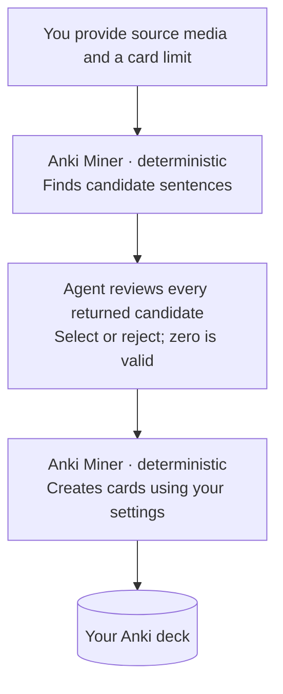

# Anki Miner Agentic

A fork of [Anki Miner](https://github.com/0xzerolight/anki_miner) that adds a bounded agent review layer around the existing mining pipeline. For the original desktop app, its features, architecture, and general help, use the [upstream README](https://github.com/0xzerolight/anki_miner#readme). Fork-specific behavior is documented under [`agentic-docs/`](agentic-docs/).

## What this fork changes

- Synchronizes learner evidence from explicitly mapped Anki decks and fields into a separate agent database.
- Deterministically prepares at most 20 review candidates using the active GUI mining policy; the agent cannot override that policy.
- Requires the agent to select or reject every returned candidate under a versioned contract, then writes only supported selections.
- Adds optional, allowlisted definition and sentence-translation fields plus durable, candidate-aligned receipts.

Most code is isolated under `anki_miner/agent`, `anki_miner/headless`, `anki_miner/mcp_server`, and `anki_miner/runtime`. Shared-pipeline changes are limited to parser integration, allowlisted optional note fields, aligned Anki write outcomes, learner-sync queries, conservative morphology corrections, and fork branding.


## How it works



## Install

You need Python 3.11+, Anki with [AnkiConnect](https://ankiweb.net/shared/info/2055492159), and ffmpeg. Keep Anki open during setup.

```bash
git clone https://github.com/namidanokisetsu/anki_miner_agentic.git
cd anki_miner_agentic
python -m venv .venv
source .venv/bin/activate  # Windows: .venv\Scripts\activate
python -m pip install -e ".[mcp]"
anki_miner_agentic_gui
```

Use a dedicated virtual environment. This fork and upstream `anki-miner` both use the `anki_miner` Python package, so do not install them together.

## Configure it

Set up dictionaries, frequency and pitch sources, Anki fields, filters, and media in the GUI. The agent inherits those settings.

## Connect an agent

Give your agent access to this checkout, then paste:

```text
Configure Anki Miner Agentic in this checkout. Read agentic-docs/agent-mining.md and skills/anki-miner-agent/SKILL.md. Reuse the active virtual environment and the GUI settings. Read deck, note-type, and field names from Anki instead of guessing them. Keep `write_target.enabled` false during setup. Validate and sync the learner profile, then register the two-tool MCP server.
```

`~/.anki_miner/agentic-agent.json` is the agent configuration file. It stores only agent-owned settings: learner evidence mappings, the write target, safety/transport limits, and allowlisted enrichment-field mappings. Mining policy and executable paths remain owned by the active GUI profile.

Use MCP for normal conversations with an agent (`prepare_mining_run`, then `commit_mining_run`). The JSON CLI's `prepare-run` and `commit-run` commands expose that same workflow for terminal use, scripts, or clients without MCP. Older low-level CLI commands remain only as a compatibility and recovery surface.

For manual setup, read the [agent mining guide](agentic-docs/agent-mining.md). Exact tool payloads are in the [MCP contract](skills/anki-miner-agent/references/mcp-contract.md).

## License

[GPL-3.0](LICENSE)
